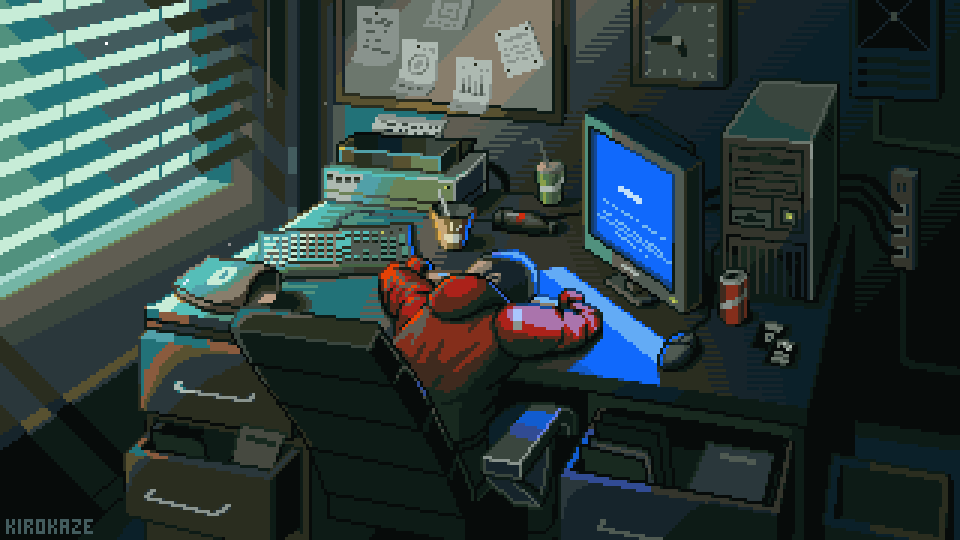

<pre>
       █████╗ ███╗   ██╗████████╗ ██████╗ ███╗   ██╗██╗ ██████╗
      ██╔══██╗████╗  ██║╚══██╔══╝██╔═══██╗████╗  ██║██║██╔═══██╗
      ███████║██╔██╗ ██║   ██║   ██║   ██║██╔██╗ ██║██║██║   ██║
      ██╔══██║██║╚██╗██║   ██║   ██║   ██║██║╚██╗██║██║██║   ██║
      ██║  ██║██║ ╚████║   ██║   ╚██████╔╝██║ ╚████║██║╚██████╔╝
      ╚═╝  ╚═╝╚═╝  ╚═══╝   ╚═╝    ╚═════╝ ╚═╝  ╚═══╝╚═╝ ╚═════╝
</pre>

  

 

---

## About Me

> Full-Stack Developer based in Madagascar, passionate about crafting clean and performant web experiences.  
> Always exploring new technologies, one project at a time.

---

## My Skills

<!-- Frontend -->

<!-- Backend -->

<!-- Tools & API -->

---

## GitHub Stats

<a href="https://next.ossinsight.io/widgets/official/compose-user-dashboard-stats?user_id=170424306" target="_blank">
  <picture>
    <source
      media="(prefers-color-scheme: dark)"
      srcset="https://next.ossinsight.io/widgets/official/compose-user-dashboard-stats/thumbnail.png?user_id=170424306&image_size=auto&color_scheme=dark"
      width="771" height="auto"
    />
    
  </picture>
</a>

---

## Contact

| Platform | Link |
|----------|------|
| Email | [ratolojanaharyantonio.pro@gmail.com](mailto:ratolojanaharyantonio.pro@gmail.com) |
| GitHub | [@MamitianaAntonio](https://github.com/MamitianaAntonio) |

---

*Thanks for stopping by — feel free to explore my repos and drop a ⭐ if something catches your eye!*

